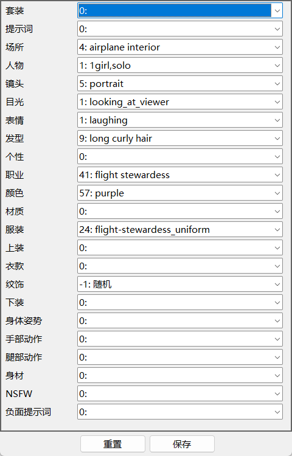
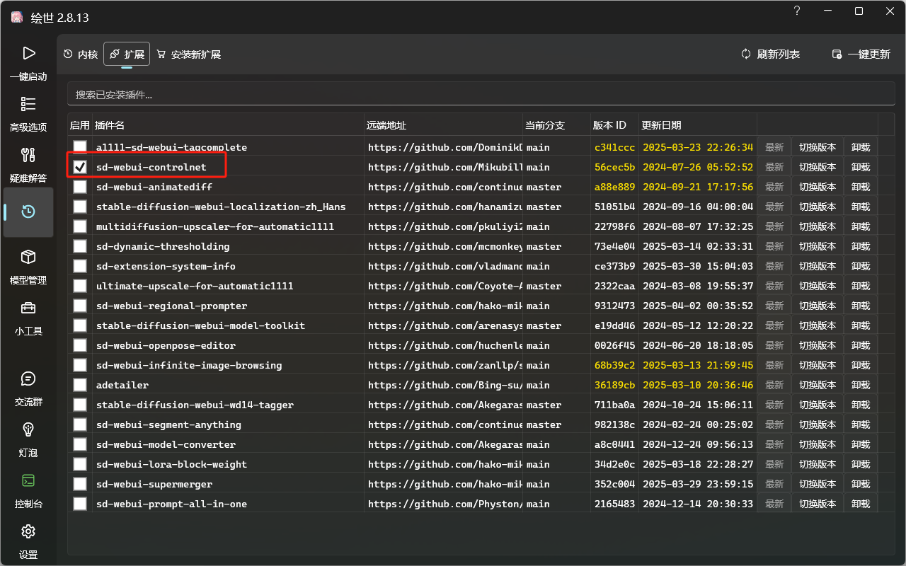
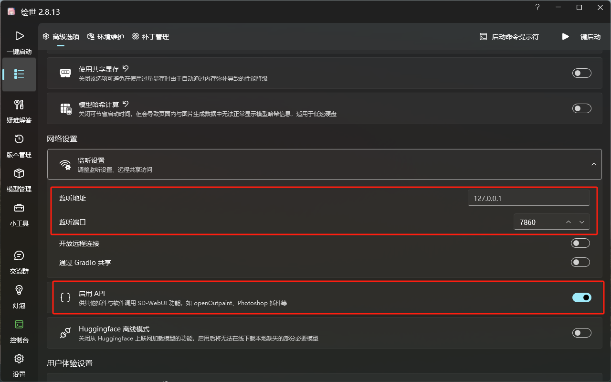

# SDWebUI API 批量工具集

这是一个批量调用 Stable Diffusion WebUI API 的工具集，用于自动化生成和管理AI生成的图片。

## 功能特点

### 1. 图片浏览器
- 使用 `Show_Pic.bat` 启动
- 支持全屏浏览
- 支持单张/双张显示切换
- 支持鼠标和键盘箭头翻页
- 支持幻灯片播放（随机模式或顺序模式）
- 右键菜单支持复制图片信息、删除图片等功能

### 2. 图片自动整理
- 使用 `Arrange_PIC.bat` 启动
- 自动识别图片文件名中的中文人名
- 按人名创建子目录
- 自动将图片移动到对应目录中

### 3. 配置文件编辑器
- 使用 `Edit_Config.bat` 启动
- 图形界面编辑prompt_config.txt

### 4. 图片克隆工具
- 使用 `Run_Clone.bat` 启动
- 将 ref 目录下的参考图片的人脸替换为 user 目录下的人脸
- 保持原图的提示词和种子不变
- ref目录下的图片，必须是SDWebUI生成的图片，或者本工具集生成的图片，也就是带了pngInfo信息的，能被SDWebUI识别的PNG图片。

### 5. 随机图片生成
- 使用 `Run_Random.bat` 启动
- 使用 user 目录下指定人物的人脸，按prompt_config的设置，随机生成不同场景和姿势的图片
- 可在 sys_config.txt 中指定人名，人名支持片段适配。如果人名为空，则在user目录中每次随机选一个；如果人名为all，则轮询user目录中的所有人。

### 6. 参考图片生成
- 使用 `Run_Referance.bat` 启动
- 随机生成参考图片到 ref 目录，用于功能4的图片克隆

## 配置文件说明

### sys_config.txt
系统配置文件，包含以下设置：
- API地址
- 输出目录
- 参考图片目录
- 用户图片目录
- 指定人名
- 模型参数设置

### prompt_config.txt
提示词配置文件，用于设置各类提示词的选择模式：
- -1：随机选择
- 0：不使用
- n：使用第n个选项

### prompt_group.txt
提示词组配置文件，包含所有可用的提示词分组：
- 场景
- 姿势
- 服装
- 表情
- 等等

## 使用要求

- Python 3.8+
- Stable Diffusion WebUI 运行环境（建议使用秋叶的一键整合包）
- 建议下载4Guofeng4XL_v12.safetensors 模型，放在\models\Stable-diffusion中。如使用其他模型，请修改sys_config.txt
- 需要安装InstantID插件control_instant_id_sdxl.safetensors、ip-adapter_instant_id_sdxl.bin，放在.\models\ControlNet中
- 需要启用controlnet

- 需要启用 WebUI 的 API 模式

